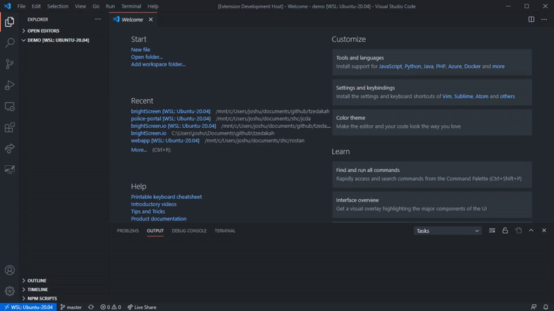

# <a href="https://brightScreen.io">  brightscreen </a>

[💙 Support this Extention 💙](https://github.com/sponsors/joshuashoemaker/)

## VS Code Extention for Students

brightScreen is an extention for your favorite text editor (as long as your text editor is VS Code) that brings interactive coding tutorials to help bring a new dynamic to learning. Instead of just following along with an article or video, you can download coding challanges that help solidify those theoretical lessons into something tangible.

Once selecting the `brightScren logo` in the activity bar you will be navigated to the `brightScreen Tree View`. If you are starting a new course, look to the bottom for the avalible brightScreen courses and install one by `clicking on the icon` that appears as you hover over an item.

After you install a course, or if you already have one installed `click the blue brightScreen logo` at the top of the tree view to activate it. This will show all the avalible lessons to the installed course.

Each lesson line item in the `Tree View` has two actions, `clicking the left icon` will paste some starter code into your active text editor. If there is an issue with this, make sure to click into a text window to activate an editor then click the icon again.

If you are ready to check your code, `click the second icon` on a lesson line item to see if your code passes.

## New Platform for Instructors

brightScreen is a great place for software instructors to create interactive homework for those that follow their courses, videos, or articles. The amount of effort in seting up a brightScreen course is virtually non existant.

All that is required is a Git repo with a brightScreen.json configuration file that looks like something like this:

    {
      "courseName": "Test Lesson",
      "documentationUrl": "https://brightScreen.io/courses/Test-Lesson/",
      "lessons": [
        {
          "name": "Lesson One",
          "location": "lessonOne/indexTest.js",
          "description": "Test Description for Lesson 1",
          "executionPrefix": "node",
          "fileExtention": "js",
          "replacementSubstring": "USER_CODE",
          "starterFileLocation": "lessonOne/lessonOneStarter.js",
          "documentationUrl": "https://brightScreen.io/courses/Test-Lesson/lesson-One/"
        },
      ]
    }

A course testing file will look something like this:

    const codeFromUser = USER_CODE

    const test = () => {
      const input = 'yo'
      const expectedOutput = 'yo'
      const testedValue = codeFromUser(input)

      if (testedValue === expectedOutput) {
        const message = {
          didPass: true,
          message: 'Passed Test 1'
        }
        console.log(JSON.stringify(message))
      } else {
        const message = {
          didPass: false,
          message: 'Did not return expected value'
        }
        console.log(JSON.stringify(message))
      }
    }

    test()

In the brightScreen.json file, for each, lesson you specify a substring you would like to replace with the User's own code and brightScreen throws it in there for you.

In theory, any interpreted language can be used for a course as long as it can be executed with a CLI and file location.

Your tests are created as a child process. To interface vack with brightScreen, your tests should return a JSON object through the Standard Out of what every platform you are testing with.

Example of Standard Out from Tests

    {
      "didPass": false,
      "message": "Value was not FizzBuzz"
    }

## Requirements

`git` should be installed on your device to install courses.

Whatever languages or platforms the instructor has listed should also be installed on your machine. For instance, if you are working on a `JavaScript` course, you may need `Node.js` installed

## Release Notes

### 0.0.1

This extention is still very much in development. If you would like to see it expanded then please reach out with suggestions or sponser me on Github.
